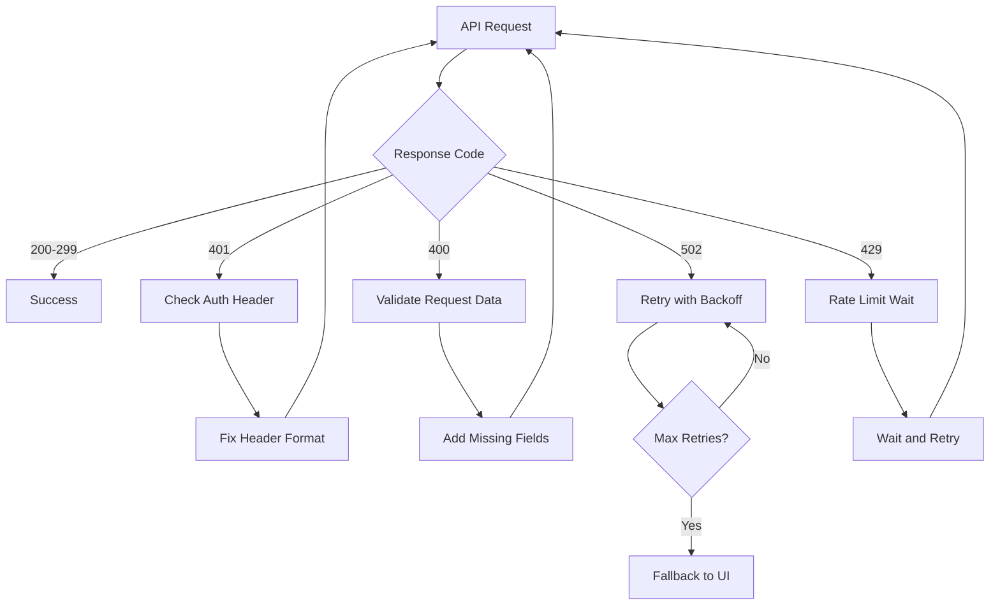

# Error Handling Guide

Comprehensive guide for handling Binom API errors based on real testing experience.

## 📊 Error Categories

### 🔐 Authentication Errors (4xx)
- [401 Unauthorized](#401-unauthorized)
- [403 Forbidden](#403-forbidden)

### 📝 Validation Errors (4xx)
- [400 Bad Request](#400-bad-request)
- [422 Unprocessable Entity](#422-unprocessable-entity)

### 🚨 Server Errors (5xx)
- [502 Bad Gateway](#502-bad-gateway) ⚠️ **Most Common**
- [503 Service Unavailable](#503-service-unavailable)
- [504 Gateway Timeout](#504-gateway-timeout)

### 🔄 Rate Limiting
- [429 Too Many Requests](#429-too-many-requests)

---

## 🔐 Authentication Errors

### 401 Unauthorized

**Most Common Cause:** Incorrect authentication method

#### ❌ Wrong Way (Bearer Token)
```bash
curl -X GET "https://pierdun.com/public/api/v1/info/offer" \
  -H "Authorization: Bearer YOUR_API_KEY"
```

#### ✅ Correct Way (API Key Header)
```bash
curl -X GET "https://pierdun.com/public/api/v1/info/offer" \
  -H "api-key: YOUR_API_KEY"
```

#### Error Response
```json
{
  "status": "error",
  "error": {
    "code": 401,
    "message": "Unauthorized",
    "details": "Invalid or missing API key"
  }
}
```

#### Recovery Strategy
1. **Check header format** - use `api-key`, not `Authorization: Bearer`
2. **Verify API key** is valid and active
3. **Check permissions** for the endpoint

---

### 403 Forbidden

#### Error Response
```json
{
  "status": "error",
  "error": {
    "code": 403,
    "message": "Forbidden",
    "details": "Insufficient permissions for this resource"
  }
}
```

#### Recovery Strategy
1. **Check user permissions** in Binom UI
2. **Verify resource ownership**
3. **Contact administrator** if needed

---

## 📝 Validation Errors

### 400 Bad Request

**Common in:** POST operations (creating resources)

#### Real Example from Testing
```bash
curl -X POST "https://pierdun.com/public/api/v1/offer" \
  -H "api-key: YOUR_API_KEY" \
  -H "Content-Type: application/json" \
  -d '{
    "name": "Test Offer",
    "url": "https://google.com"
  }'
```

#### Error Response
```json
{
  "status": "error",
  "error": {
    "code": 400,
    "message": "Bad Request",
    "details": "Constructor arguments validation failed"
  }
}
```

#### Recovery Strategy
1. **Check required fields** in endpoint documentation
2. **Validate data types** (string, integer, boolean)
3. **Review field constraints** (min/max length, format)
4. **Add missing parameters** step by step

#### Common Missing Fields
- `datePreset` and `timezone` for stats endpoints
- `s2sMode` for traffic source creation
- `type` or `category` fields

---

### 422 Unprocessable Entity

#### Error Response
```json
{
  "status": "error",
  "error": {
    "code": 422,
    "message": "Unprocessable Entity",
    "details": "Validation failed for field 'name': must be unique"
  }
}
```

#### Recovery Strategy
1. **Check business rules** (uniqueness, dependencies)
2. **Modify conflicting values**
3. **Verify related resources** exist

---

## 🚨 Server Errors

### 502 Bad Gateway ⚠️ **CRITICAL**

**Most Common Error** in POST operations

#### Real Example from Testing
```bash
curl -X POST "https://pierdun.com/public/api/v1/landing/integrated" \
  -H "api-key: YOUR_API_KEY" \
  -H "Content-Type: application/json" \
  -d '{
    "name": "Test Landing",
    "path": "/test-landing"
  }'
```

#### Error Response
```json
{
  "status": "error",
  "error": {
    "code": 502,
    "message": "Bad Gateway",
    "details": "Server temporarily unavailable"
  }
}
```

#### Recovery Strategy (Exponential Backoff)
```python
import time
import requests

def retry_with_backoff(func, max_retries=3):
    for attempt in range(max_retries):
        try:
            response = func()
            if response.status_code != 502:
                return response
        except Exception as e:
            pass
        
        if attempt < max_retries - 1:
            wait_time = 2 ** attempt  # 1s, 2s, 4s
            print(f"Retry {attempt + 1} in {wait_time}s...")
            time.sleep(wait_time)
    
    return None  # All retries failed
```

#### Fallback Strategy
If all retries fail:
1. **Switch to manual UI** operations
2. **Use GET endpoints** to verify state
3. **Report issue** to Binom support
4. **Document workaround** for future use

---

### 503 Service Unavailable

#### Error Response
```json
{
  "status": "error",
  "error": {
    "code": 503,
    "message": "Service Unavailable",
    "details": "Server is under maintenance"
  }
}
```

#### Recovery Strategy
1. **Wait 5-10 minutes** for maintenance to complete
2. **Check Binom status page** if available
3. **Use cached data** if possible
4. **Implement circuit breaker** pattern

---

### 504 Gateway Timeout

#### Recovery Strategy
1. **Increase request timeout** (30+ seconds)
2. **Break large requests** into smaller chunks
3. **Use pagination** for bulk operations
4. **Implement async processing**

---

## 🔄 Rate Limiting

### 429 Too Many Requests

#### Error Response
```json
{
  "status": "error",
  "error": {
    "code": 429,
    "message": "Too Many Requests",
    "details": "Rate limit exceeded: 10 requests per second"
  }
}
```

#### Recovery Strategy
```python
import time
from datetime import datetime, timedelta

class RateLimiter:
    def __init__(self, max_requests=10, time_window=1):
        self.max_requests = max_requests
        self.time_window = time_window
        self.requests = []
    
    def wait_if_needed(self):
        now = datetime.now()
        # Remove old requests
        self.requests = [req for req in self.requests 
                        if now - req < timedelta(seconds=self.time_window)]
        
        if len(self.requests) >= self.max_requests:
            sleep_time = self.time_window - (now - self.requests[0]).total_seconds()
            if sleep_time > 0:
                time.sleep(sleep_time)
        
        self.requests.append(now)
```

---

## 🛠️ Error Handling Best Practices

### 1. Comprehensive Error Detection
```python
def handle_api_response(response):
    if response.status_code == 200:
        return response.json()
    elif response.status_code == 401:
        raise AuthenticationError("Check api-key header format")
    elif response.status_code == 502:
        raise ServerError("Bad Gateway - retry with backoff")
    elif response.status_code == 400:
        raise ValidationError("Check required fields")
    else:
        raise APIError(f"Unexpected error: {response.status_code}")
```

### 2. Logging and Monitoring
```python
import logging

def log_api_error(endpoint, error, request_data=None):
    logging.error(f"API Error: {endpoint}")
    logging.error(f"Error: {error}")
    if request_data:
        logging.error(f"Request: {request_data}")
```

### 3. Circuit Breaker Pattern
```python
class CircuitBreaker:
    def __init__(self, failure_threshold=5, timeout=60):
        self.failure_threshold = failure_threshold
        self.timeout = timeout
        self.failure_count = 0
        self.last_failure_time = None
        self.state = "CLOSED"  # CLOSED, OPEN, HALF_OPEN
    
    def call(self, func):
        if self.state == "OPEN":
            if time.time() - self.last_failure_time > self.timeout:
                self.state = "HALF_OPEN"
            else:
                raise Exception("Circuit breaker is OPEN")
        
        try:
            result = func()
            self.on_success()
            return result
        except Exception as e:
            self.on_failure()
            raise e
```

---

## 📋 Quick Error Reference

| Code | Type | Common Cause | Solution |
|------|------|--------------|----------|
| 401 | Auth | Wrong header format | Use `api-key` header |
| 400 | Validation | Missing fields | Check required parameters |
| 502 | Server | Server overload | Retry with backoff |
| 429 | Rate Limit | Too many requests | Implement rate limiting |

---

## 🤖 AI Agent Error Handling

### Prompt Engineering for Errors
```
When encountering Binom API errors:

1. For 401 errors: Check if using 'api-key' header (not Bearer token)
2. For 502 errors: Retry 3 times with exponential backoff (1s, 2s, 4s)
3. For 400 errors: Review required fields in documentation
4. For persistent errors: Suggest manual UI operation as fallback

Always log errors with full context for debugging.
```

### Error Recovery Workflow


This comprehensive error handling guide ensures robust API integration and provides clear recovery strategies for all common error scenarios.
