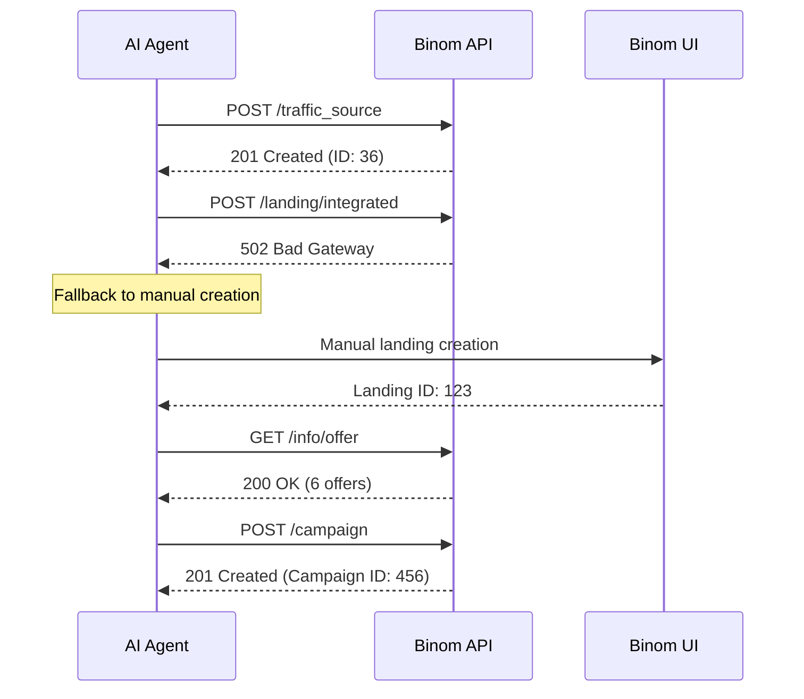
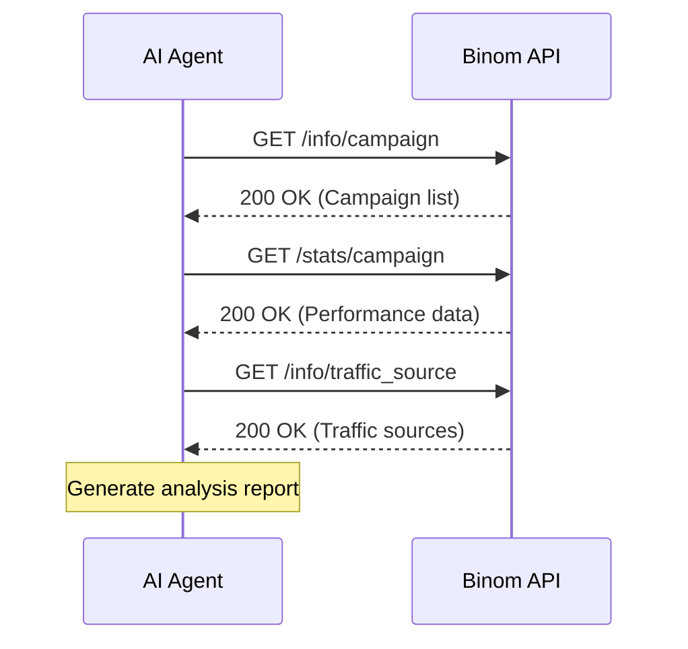

# Common API Workflow Scenarios

This document contains real-world scenarios for working with Binom API, based on actual testing and implementation experience.

## 🎯 Scenario 1: Complete Campaign Setup

### Overview
Create a complete campaign from scratch including traffic source, landing page, and offer.

### Prerequisites
- Valid API key
- Basic understanding of campaign structure

### Step-by-Step Workflow



#### 1. Create Traffic Source ✅ WORKING

```bash
curl -X POST "https://pierdun.com/public/api/v1/traffic_source" \
  -H "api-key: YOUR_API_KEY" \
  -H "Content-Type: application/json" \
  -d '{
    "name": "Test Traffic Source",
    "s2sMode": "FIRST"
  }'
```

**Expected Response:**
```json
{
  "status": "success",
  "data": {
    "id": 36,
    "name": "Test Traffic Source",
    "s2sMode": "FIRST",
    "created": "2025-09-27T00:00:00Z"
  }
}
```

#### 2. Create Landing Page ❌ UNSTABLE

```bash
curl -X POST "https://pierdun.com/public/api/v1/landing/integrated" \
  -H "api-key: YOUR_API_KEY" \
  -H "Content-Type: application/json" \
  -d '{
    "name": "Test Landing",
    "path": "/test-landing"
  }'
```

**Common Error:**
```json
{
  "status": "error",
  "error": {
    "code": 502,
    "message": "Bad Gateway",
    "details": "Server temporarily unavailable. Please retry in 5-10 seconds."
  }
}
```

**Fallback Strategy:** Use Binom UI for landing creation, then get ID via API.

#### 3. Get Available Offers ✅ WORKING

```bash
curl -X GET "https://pierdun.com/public/api/v1/info/offer?datePreset=today&timezone=UTC" \
  -H "api-key: YOUR_API_KEY"
```

**Expected Response:**
```json
{
  "status": "success",
  "data": [
    {"id": 1, "name": "Test Offer 1", "url": "https://example.com/offer1"},
    {"id": 2, "name": "Test Offer 2", "url": "https://example.com/offer2"}
  ],
  "total": 6
}
```

### Success Criteria
- ✅ Traffic source created (ID returned)
- ⚠️ Landing page created (may require manual fallback)
- ✅ Offers retrieved successfully
- ✅ Campaign structure ready

---

## 🔍 Scenario 2: Traffic Analysis & Reporting

### Overview
Analyze campaign performance and generate reports using stable GET endpoints.

### Workflow



#### 1. Get Campaign List ✅ WORKING

```bash
curl -X GET "https://pierdun.com/public/api/v1/info/campaign?datePreset=last_7_days&timezone=UTC" \
  -H "api-key: YOUR_API_KEY"
```

#### 2. Get Performance Stats ✅ WORKING

```bash
curl -X GET "https://pierdun.com/public/api/v1/stats/campaign?datePreset=last_7_days&timezone=UTC" \
  -H "api-key: YOUR_API_KEY"
```

### Success Criteria
- ✅ All GET operations work reliably
- ✅ Data consistency across endpoints
- ✅ Report generation possible

---

## 🚨 Scenario 3: Error Handling & Recovery

### Overview
Handle common API errors and implement recovery strategies.

### Common Error Patterns

#### Authentication Error (401)
```json
{
  "status": "error",
  "error": {
    "code": 401,
    "message": "Unauthorized",
    "details": "Use 'api-key' header, NOT 'Authorization: Bearer'"
  }
}
```

**Solution:** Always use `api-key` header format.

#### Server Error (502)
```json
{
  "status": "error",
  "error": {
    "code": 502,
    "message": "Bad Gateway",
    "details": "Server temporarily unavailable. Please retry in 5-10 seconds."
  }
}
```

**Recovery Strategy:**
1. Wait 5-10 seconds
2. Retry with exponential backoff
3. Maximum 3 retry attempts
4. Fallback to manual UI operations

#### Validation Error (400)
```json
{
  "status": "error",
  "error": {
    "code": 400,
    "message": "Bad Request",
    "details": "Constructor arguments validation failed"
  }
}
```

**Solution:** Check required fields and data types.

---

## 🔄 Scenario 4: Bulk Operations

### Overview
Perform operations on multiple resources efficiently.

### Best Practices
1. **Use batch endpoints** when available
2. **Implement rate limiting** (max 10 requests/second)
3. **Handle partial failures** gracefully
4. **Log all operations** for debugging

---

## 🎯 Scenario 5: Campaign Optimization

### Overview
Optimize existing campaigns based on performance data.

### Workflow
1. **Analyze performance** using stats endpoints
2. **Identify underperforming** elements
3. **Update configurations** via PUT endpoints
4. **Monitor results** and iterate

---

## 📋 Quick Reference

### Stable Endpoints (100% reliability)
- `GET /info/*` - All info endpoints
- `GET /stats/*` - All stats endpoints

### Unstable Endpoints (require fallbacks)
- `POST /landing/*` - Landing creation (502 errors)
- `POST /offer/*` - Offer creation (400 errors)

### Required Parameters
- `datePreset` - Always required for stats
- `timezone` - Always required for stats
- `api-key` - Required in header (NOT Bearer token)

### Rate Limits
- **10 requests/second** maximum
- **Exponential backoff** for 502 errors
- **3 retry attempts** maximum

---

## 🤖 AI Agent Integration

### Prompt Engineering Examples

#### For Campaign Analysis:
```
Analyze campaign performance using Binom API:
1. Get campaign list: GET /info/campaign
2. Get performance stats: GET /stats/campaign  
3. Use datePreset=last_7_days and timezone=UTC
4. Handle 401 errors by checking api-key header format
```

#### For Error Recovery:
```
If you encounter 502 Bad Gateway:
1. Wait 5-10 seconds
2. Retry the same request
3. Maximum 3 attempts
4. If still failing, suggest manual UI operation
```

### Integration Tips
- Always validate API responses before processing
- Implement comprehensive error handling
- Use stable endpoints for critical operations
- Have fallback strategies for unstable endpoints
